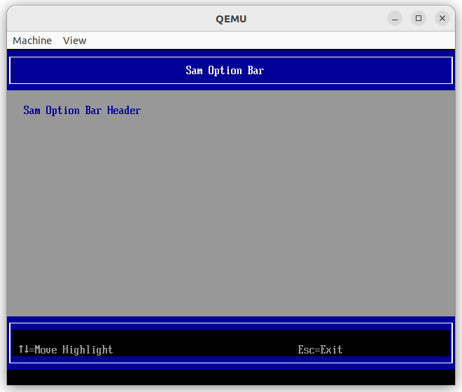

# How to use `SamOptionLib`

## 1. Configuration

- Add `SamOptionLib.inf` into OvmfPkgX64.dsc, like below:

```dsc

################################################################################
#
# Components Section - list of all EDK II Modules needed by this Platform.
#
################################################################################
[Components]

...

  MdeModulePkg/Application/UiApp/UiApp.inf {
    <LibraryClasses>
      NULL|MdeModulePkg/Library/DeviceManagerUiLib/DeviceManagerUiLib.inf
      NULL|MdeModulePkg/Library/BootManagerUiLib/BootManagerUiLib.inf
      NULL|MdeModulePkg/Library/BootMaintenanceManagerUiLib/BootMaintenanceManagerUiLib.inf
      // Add this
      NULL|SamModulePkg/Debug/Edk2Debug/SamOption/SamOptionLib.inf
      // Add this
    }

...

```

- Build OVMF:

```shell
build -p OvmfPkg/OvmfPkgX64.dsc -t GCC5 -a X64 -b DEBUG
```

- Run OVMF.fd

## 2. Screenshot

- 20250226

  
  
